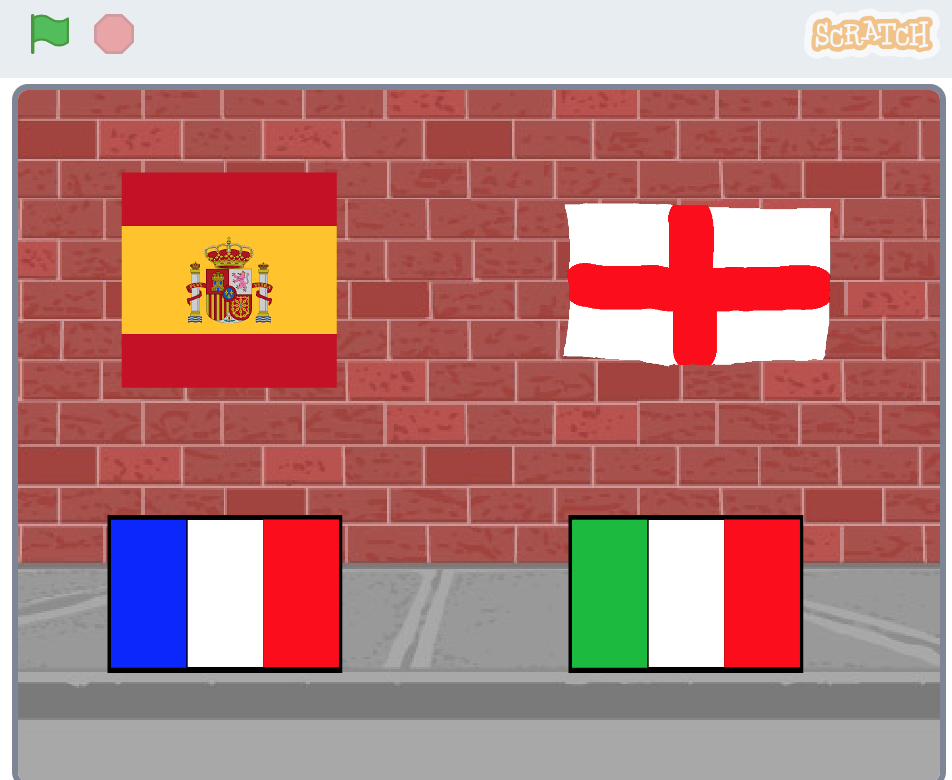

## Introduction

In this project, you will create an interactive phrasebook that translates useful phrases into different languages.

### What you will make

--- no-print ---
Click on a country's flag to choose a language. Then click on objects to hear some translated phrases.

  <iframe allowtransparency="true" width="485" height="402" src="https://scratch.mit.edu/projects/embed/277527926/?autostart=false" frameborder="0" scrolling="no"></iframe>

--- /no-print ---

--- print-only ---

--- /print-only ---

--- collapse ---
---
title: What you will need
---
### Hardware

A computer capable of running Scratch 3.0, with loudspeakers

### Software

Scratch 3.0 (either [online](http://rpf.io/scratchon) or [offline](http://rpf.io/scratchoff))

--- /collapse ---

--- collapse ---
---
title: What you will learn
---

+ How to draw sprites and backdrops
+ How to switch between two backdrops
+ How to use the Google Translate extension
+ How to use the Text to Speech extension

--- /collapse ---

--- collapse ---
---
title: Additional information for educators
---

If you need to print this project, please use the [printer-friendly version](https://projects.raspberrypi.org/en/projects/scratch-3-phrasebook/print){:target="_blank"}.

[Here is a link to the resources for this project](rpf.io/phrasebook-resources).

--- /collapse ---
