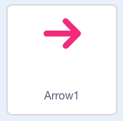

## Switching the backdrop

The backdrop is becoming crowded due to the flags on it, next let's create a second backdrop where you can place your phrase sprites. You'll switch to the second backdrop when a flag is clicked. At the same time, you should hide the flags and show the phrase sprites.

--- task ---
Add or Paint a new backdrop by clicking the Choose a backdrop button. You could use the Beach Malibu backdrop as you will see in this project.
--- /task ---

--- task ---
Add the following code to the spain flag sprite:


```blocks3
when this sprite clicked
set [language v] to [Spanish]
say [\[Hello\] in (language)] for (2) secs :: extension
+ switch backdrop to [Beach Malibu v]

when backdrop switches to [Beach Malibu v]
hide
```

Clicking on the spain flag should now switch the backdrop and hide itself.
--- /task ---
--- task ---
Let's also include a way to swap back to the start screen. Create a new sprite and select Arrow1


Change the direction of the arrow to '-90' in the sprite information panel below the stage, then drag the arrow into the top left corner of the stage

Add the following code to the arrow sprite:


```blocks3
when this sprite clicked
switch backdrop to [Wall 1 v]

when backdrop switches to [Wall 1 v]
hide

when backdrop switches to [Beach Malibu v]
show
```

Now the arrow brings us back to the starting backdrop but, we've lost our spain flag! If you add the following code to the spain flag sprite, it should fix our problem:


```blocks3
when backdrop switches to [Wall 1 v]
show
```
--- /task ---
--- task ---
Now we can switch backdrops by clicking on the spain flag and on our arrow. Can you add code so that our england flag can be used to switch backdrops in the same way?

--- hints ---
--- hint ---
Just like the spain flag sprite, you need to `switch backdrop to Beach Malibu`{:class="block3looks"}. You also need to `show`{:class="block3looks"} the flag `when the backdrop switches to Wall 1`{:class="block3events"} and `hide`{:class="block3looks"} the flag `when the backdrop switches to Beach Malibu`{:class="block3events"}.
--- /hint ---
--- hint ---
These are the code blocks you need to add to the england flag sprite:
```blocks3
hide

when backdrop switches to [ v]

show

switch backdrop to [Beach Malibu v]
```
--- /hint ---
--- hint ---
Here's what your code should look like for the england flag sprite:


```blocks3
when this sprite clicked
set [language v] to [English]
say [\[Hello\] in (language)] for (2) secs :: extension
+ switch backdrop to [Beach Malibu v]

when backdrop switches to [Beach Malibu v]
hide

when backdrop switches to [Wall 1 v]
show
```
--- /hint ---
--- /hints ---
--- /task ---
--- task ---
Test your code to ensure everything works correctly.
Does the backdrop switch between the two you selected?
Do the sprites appear and disappear as expected?

--- /task ---