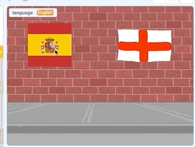
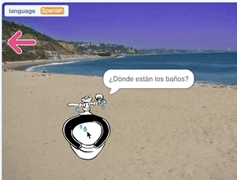

## Text to Speech

Now you'll use another new tool in Scratch 3.0: Text to Speech!

--- task ---
When you are in a country where people speak a different language to you, it is very useful to know the translation for the sentence "Where are the toilets?". You will add a new sprite to trigger this phrase. 

If you want to, you can create the new sprite by drawing a toilet.

[[[generic-scratch3-draw-sprite]]]

Or you can use the image in this project's [resources](https://github.com/raspberrypilearning/scratch-3-phrasebook/tree/master/en/resources):

--- /task ---

--- task ---
Add code to the toilet sprite to show or hide the sprite when the backdrop switches.

```blocks3
when backdrop switches to [Wall 1 v]
hide

when backdrop switches to [Beach Malibu v]
show
```
--- /task ---
--- task ---
Now add some code to the same sprite to translate the question "Where are the toilets?" into the language that is stored in the `language`{:class="block3variables"} variable. 


```blocks3
when this sprite clicked
say (translate [Where are the toilets?] to (language):: extension) for (2) secs
```
--- /task ---

Next, try out the new Text to Speech tool!

--- task ---

Add the Text to Speech extension in the same way as you added the Google Translate extension.
--- /task ---
--- task ---
First, set the language on our Spanish and England flag sprites.


```blocks3
when this sprite clicked
set [language v] to [Spanish]
+ set language to [Spanish \(European\) v] :: extension
say (translate [Hello] to (language):: extension) for (2) secs
switch backdrop to [Beach Malibu v]
```


```blocks3
when this sprite clicked
set [language v] to [English]
+ set language to [English v] :: extension
say (translate [Hello] to (language):: extension) for (2) secs
switch backdrop to [Beach Malibu v]
```
--- /task ---
--- task ---
Then add this code to the toilet sprite:


```blocks3
when this sprite clicked
speak(translate[Where are the toilets?] to (language)::extension) ::extension
```
--- /task ---
--- task ---
Now test your code.

You should be able to click the Spanish flag to set the language to Spanish, and then click the toilet to see **and hear** how "Where are the toilets?" is said in Spanish. It's "¿Dónde están los baños?"! The English flag should work for English too.

--- no-print ---

--- /no-print ---

--- print-only ---

--- /print-only ---

--- /task ---
