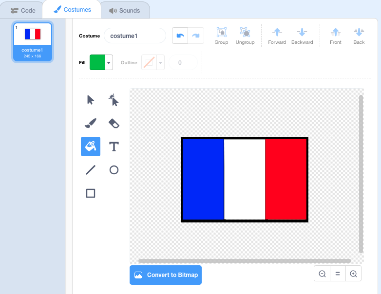

## More languages

So far, you can use your phrasebook in countries where Spanish or English is spoken. Now add some more languages.

To see the list of languages that you can translate to, click on the little triangle in the `translate`{:class="block3extensions"} code block.

If you want to hear the translations with the correct pronunciation, also check the languages in the Speech to Text extension.

I'm adding French, as the French flag is easy to draw and French is spoken in a lot of countries around the world.

--- task ---
First, duplicate the Spanish flag sprite so that you can reuse its code! 
--- /task ---
--- task ---
Next, choose or draw a new costume for the French flag sprite. It's easy to draw:

Then delete the old costume.
--- /task ---
--- task ---
Finally, change the code so that clicking the sprite sets the `language`{:class="block3data"} variable and the Text to Speech `set language to`{:class="block3extensions"} code blocks to French instead of Spanish.

Your French flag sprite's code should now look like this:


```blocks3
when this sprite clicked
+ set [language v] to [French]
+ set language to [French) v] :: extension
say [\[Hello\] in (language)] for (2) secs :: extension
switch backdrop to [Beach Malibu v]

when backdrop switches to [Beach Malibu v]
hide

when backdrop switches to [Wall 1 v]
show
```
--- /task ---
--- task ---
Add Italian to your phrasebook. 

--- hints ---
--- hint ---
First, duplicate a sprite with most of the code (the French flag also looks very similar to the Italian!). Then choose or draw a suitable costume, and finally change the language in the sprite's language code blocks.
--- /hint ---
--- hint ---
The code for the new Italian flag sprite looks like this:


```blocks3
when this sprite clicked
+ set [language v] to [Italian]
+ set language to [Italian) v] :: extension
say [\[Hello\] in (language)] for (2) secs :: extension
switch backdrop to [Beach Malibu v]

when backdrop switches to [Beach Malibu v]
hide

when backdrop switches to [Wall 1 v]
show
```
--- /hint ---
--- /hints ---
--- /task ---
